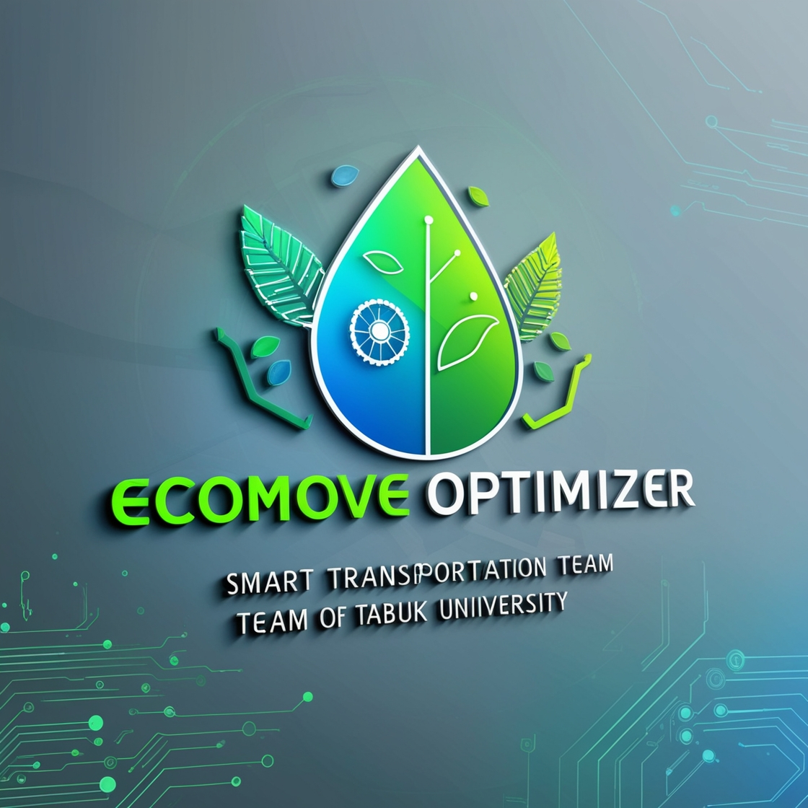

# Tabuk University EcoMove 🌿



## Overview

EcoMove is an innovative smart transportation solution designed specifically for Tabuk University's campus community. The platform combines real-time traffic monitoring, intelligent route planning, and community-based ride sharing to optimize campus mobility while reducing environmental impact.

## Key Features

### 1. Dashboard (لوحة التحكم)
- **Interactive Traffic Map**: Real-time visualization of campus traffic patterns
- **Heat Map Visualization**: Dynamic representation of congestion areas
- **Quick Stats Display**: 
  - Active rides monitoring
  - CO2 emissions saved
  - Temperature readings
  - Air quality index
- **Traffic Density Timeline**: Hourly traffic patterns throughout the day

### 2. Route Planner (مخطط الطريق)
- **Smart Route Calculation**: Finds optimal paths between campus locations
- **Congestion-Aware Routing**: Considers current traffic conditions
- **Visual Route Display**: Interactive map showing:
  - Start and end points
  - Route visualization
  - Traffic intensity indicators
- **Route Statistics**:
  - Distance calculation
  - Estimated time of arrival
  - Carbon footprint impact
  - Current traffic levels

### 3. Ride Sharing (مشاركة الركوب)
- **Ride Search**: Find available rides matching your route
- **Ride Offering**: Create and manage ride offers
- **Features**:
  - Real-time ride matching
  - Driver ratings and reviews
  - Flexible scheduling options
  - Seat availability management

### 4. Analytics (التحليلات)
- **Traffic Pattern Analysis**: Historical and real-time traffic data
- **Usage Statistics**:
  - Weekly ride counts
  - CO2 savings metrics
  - Popular routes analysis
- **Performance Metrics**: System efficiency and impact measurements

## Technical Architecture

### Frontend
- Streamlit for the web interface
- Folium for interactive maps
- Bilingual support (English/Arabic)
- Responsive design for multiple devices

### Backend
- Python 3.12+ runtime
- Real-time data processing
- Session state management
- Caching mechanisms for performance

### Data Management
- Location coordinate system
- Traffic intensity calculations
- Heat map data generation
- Route optimization algorithms

## Installation

1. Clone the repository:
```bash
git clone https://github.com/yourusername/tabuk-ecomove.git
```

2. Navigate to project directory:
```bash
cd tabuk-ecomove
```

3. Install dependencies:
```bash
pip install -r requirements.txt
```

4. Set up environment variables:
Create a `.env` file with:
```
GOOGLE_MAPS_API_KEY=your_api_key_here
```

5. Run the application:
```bash
streamlit run app.py
```

## Dependencies

```
streamlit>=1.24.0
folium>=0.14.0
pandas>=2.0.0
numpy>=1.24.0
python-dotenv>=1.0.0
Pillow>=10.0.0
streamlit-folium>=0.15.0
```

## Data Structure

### Campus Locations
- Main Gate
- College of Engineering
- College of Medicine
- Student Housing
- University Library

### Traffic Monitoring
- Road segments with intensity levels
- Congestion points with severity indicators
- Historical traffic patterns
- Real-time updates

## Contributing

1. Fork the repository
2. Create a feature branch (`git checkout -b feature/AmazingFeature`)
3. Commit changes (`git commit -m 'Add AmazingFeature'`)
4. Push to branch (`git push origin feature/AmazingFeature`)
5. Open a Pull Request

## Development Guidelines

- Follow PEP 8 style guidelines
- Add comments for complex logic
- Update documentation for new features
- Include tests for new functionality
- Maintain bilingual support

## Future Enhancements

- Mobile application development
- Integration with university ID system
- Automated congestion prediction
- Enhanced carbon footprint tracking
- Real-time weather integration
- Expanded analytics capabilities

## License

hhijry-coder/EcoMove is licensed under the GNU Affero General Public License v3.0


## Contact
- Website: https://www.tabukuniversity.edu.sa
- Project Link: https://github.com/yourusername/tabuk-ecomove
